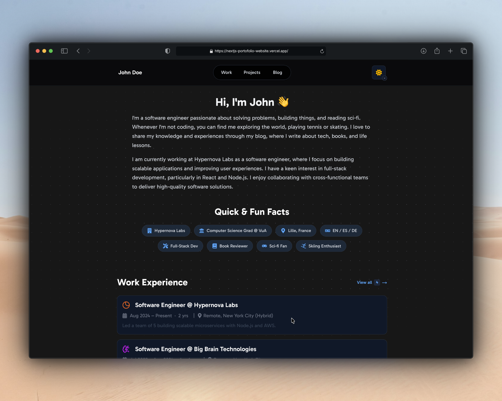
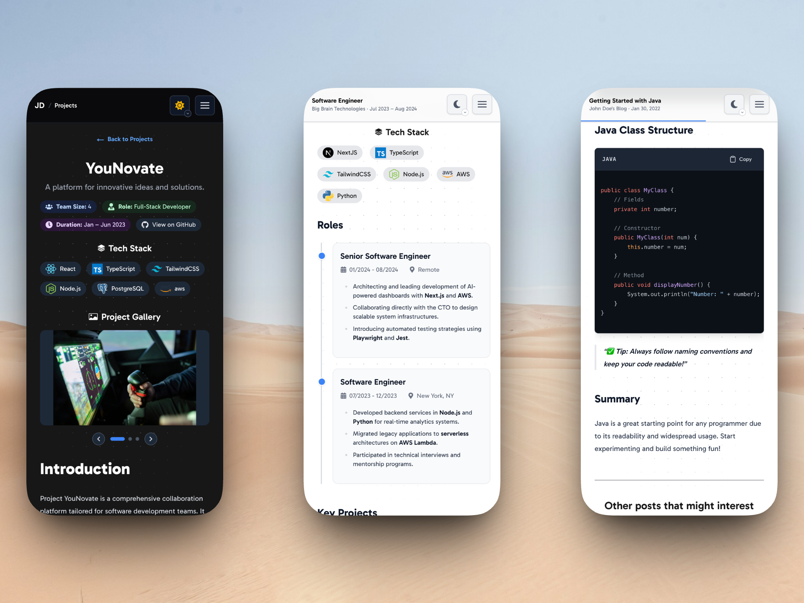
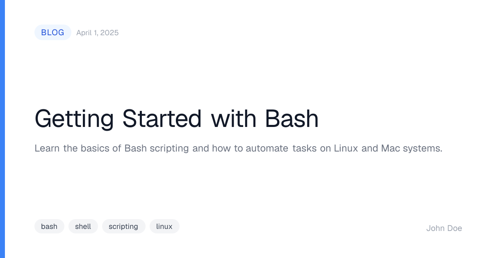
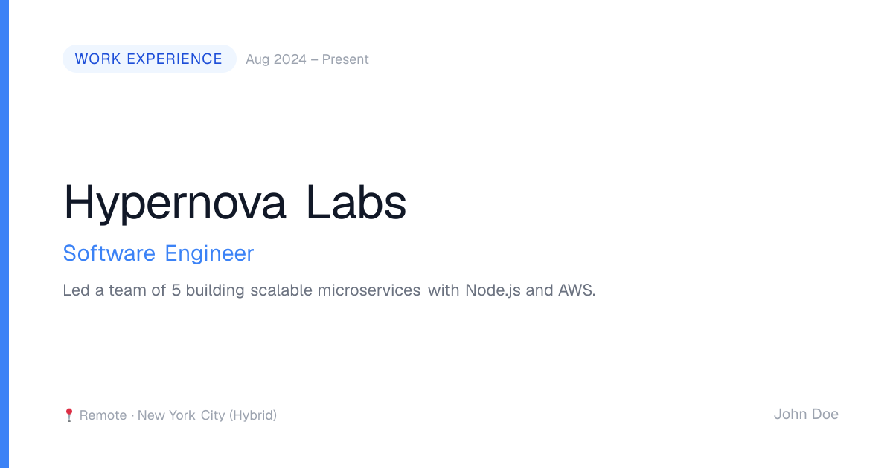
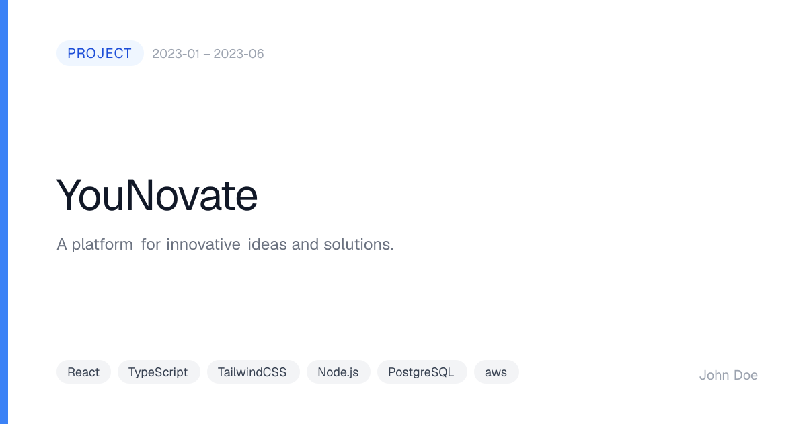
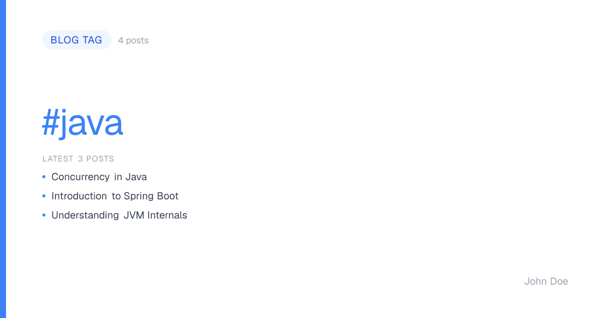

# Plantilla de Sitio Web Personal con Tema de Desarrollador para Next.js

Este es un tema personalizado para sitio web construido con [Next.js](https://nextjs.org), inicializado con
[`create-next-app`](https://nextjs.org/docs/app/api-reference/cli/create-next-app). Está diseñado como un punto de partida minimalista
y enfocado en el rendimiento para mostrar tu **trabajo**, **blog** y **proyectos**.

<div align="center">


</div>

<details>
<summary><b>📝 Nota del Autor Sobre Este Tema</b></summary>

Este tema está dirigido principalmente a desarrolladores y diseñadores que desean crear un sitio web personal de forma rápida y sencilla. Sí,
soy consciente de que existen muchas otras plantillas y temas disponibles... _literalmente puedes encontrarlos en todo internet_. El
objetivo personal al construir este tema fue familiarizarme con [Next.js](https://nextjs.org) y mejorar mis habilidades en
**React** y **TypeScript**.

También quería crear una plantilla inicial para mí mismo, ya que ninguna de las plantillas existentes cumplía con mis necesidades exactas de diseño y
funcionalidad sin requerir modificaciones extensas. Así que... ¡aquí estamos! Siente libre de usar esto como punto
de partida para tu propio sitio web personal, o como referencia para hacer lo mismo que hice: _¡construir tu propio tema personalizado!_

</details>





---

## 📋 Tabla de Contenidos

- [💎 Características Principales](#-caracteristicas-principales)
- [🧱 Estructura del Proyecto](#-estructura-del-proyecto)
- [🚀 Primeros Pasos](#-primeros-pasos)
- [🎨 Personalización](#-personalizacion)
- [🔍 SEO](#-seo)
- [🧭 Hoja de Ruta](#-hoja-de-ruta)
- [📚 Aprende Más](#-aprende-mas)
- [▲ Despliegue](#-despliegue)
- [🛠 Stack Tecnológico](#-stack-tecnologico)
- [💎 Calidad de Código y Directrices](#-calidad-de-codigo-y-directrices)
- [🪪 Licencia](#-licencia)
- [💬 Retroalimentación y Contribuciones](#-retroalimentacion-y-contribuciones)

---

## 💎 Características Principales

- Panel principal (página de inicio), con enlaces a `/work`, `/projects` y `/blog`
- Soporte para [MDX](https://mdxjs.com/) en publicaciones del blog, proyectos y elementos de trabajo
- Frontmatter validado con [Zod](https://zod.dev/) para todos los tipos de contenido MDX. Los archivos inválidos se detectan en el momento de la compilación con
  mensajes de error precisos a nivel de campo
- Resaltado de sintaxis para bloques de código en archivos MDX
- Alternador de modo claro/oscuro. El clásico interruptor de temas ;)
- Selector de color de acento en tiempo de ejecución: haz clic derecho (o mantén presionado en dispositivos táctiles) el botón de alternancia del tema para cambiar entre
  10 colores de acento al vuelo. La elección se recuerda entre visitas mediante `localStorage`
- Diseño responsive para móviles y escritorio
- Estructura y metadatos amigables para SEO,
  incluyendo [datos estructurados JSON-LD](https://developers.google.com/search/docs/appearance/structured-data/intro-structured-data)
  en la página de inicio y publicaciones del blog para ser elegibles para resultados enriquecidos de Google. Para más contexto, consulta también
  la [guía de JSON-LD de Vercel](https://nextjs.org/docs/app/guides/json-ld)
- `sitemap.xml` automático que descubre cada publicación del blog, proyecto, elemento de trabajo y página de etiquetas en el momento de la compilación. ¡No
  se necesitan actualizaciones manuales al agregar o eliminar contenido! (Consulta `src/app/sitemap.ts` para detalles de implementación)
- Soporte SSR para paginación, ordenamiento y filtrado de publicaciones del blog, proyectos y elementos de trabajo
- Recomendaciones de publicaciones similares
- Páginas de categorías para publicaciones del blog
- Ruta [LLMs.txt](https://llmstxt.org/) generada automáticamente a partir de los metadatos del contenido para ayudar a agentes/rastreros a descubrir
  tu contenido
- Feed `RSS.xml` generado automáticamente a partir de las publicaciones del blog disponibles en el sitio
- [Generación dinámica de imágenes Open Graph](https://nextjs.org/docs/app/getting-started/metadata-and-og-images#generated-open-graph-images)
  para la página de inicio, `/blog`, `/projects`, `/work` y todas sus páginas individuales de publicaciones, elementos y etiquetas
- Personalización fácil a través de un archivo de configuración centralizado (`src/data/metadata.ts` y `src/data/content.ts`) para todos
  los ajustes de contenido y apariencia del sitio

---

## 🧱 Estructura del Proyecto

El sitio está organizado alrededor de las siguientes rutas/páginas principales:

- 🏠 **Inicio** – `/`
- 💼 **Trabajo** – `/work`
- 🛠️ **Proyectos** – `/projects`
- ✍️ **Blog** – `/blog`

Cada página es intencionalmente _simple_ y _limpia_, lo que facilita su personalización y ampliación.

### ✨ Configuración Mínima Requerida

Este tema está diseñado con la **simplicidad** en mente. Después de personalizar tu página de inicio, agregar contenido es tan fácil como
crear archivos `.mdx`:

- **Publicaciones del Blog**: Coloca un nuevo archivo `.mdx` en `src/data/blog/` con frontmatter (título, resumen, fecha, etiquetas)
- **Elementos de Trabajo**: Agrega un archivo `.mdx` en `src/data/work/` con los detalles de tu trabajo
- **Proyectos**: Crea un archivo `.mdx` en `src/data/projects/` con la información del proyecto

¡Eso es todo! No hay archivos de configuración manuales que actualizar, ni matrices que mantener. El sitio descubre y renderiza automáticamente
tu contenido. Simplemente escribe tu contenido en Markdown, agrega metadatos en el frontmatter y el tema se encarga del resto: generando
páginas, navegación, filtrado y capacidades de búsqueda automáticamente.

---

## 🚀 Primeros Pasos

Después de clonar el repositorio, instala primero las dependencias:

```bash
npm install
```

o vía `pnpm` (recomendado):

```bash
pnpm install
```

Esto también configura los hooks de Git del proyecto (vía [Husky](https://typicode.github.io/husky)) automáticamente, sin necesidad de configuración adicional. Consulta [Calidad de Código y Directrices](#-calidad-de-codigo-y-directrices) para ver qué revisan esos hooks.

Para iniciar tu entorno de desarrollo localmente, ejecuta el siguiente comando en el directorio raíz del proyecto:

```bash
npm run dev
```

o vía `pnpm` (recomendado):

```bash
pnpm dev
```

Una vez que el servidor esté en ejecución, abre [http://localhost:3000](http://localhost:3000) en tu navegador para ver la
página de inicio. Ejecutar este comando inicia la aplicación en modo de desarrollo con recarga automática habilitada, por lo que cualquier cambio que realices en
el código se reflejará automáticamente en el navegador sin necesidad de reiniciar el servidor.

También puedes compilar el proyecto para producción usando:

```bash
npm run build
```

o vía `pnpm`:

```bash
pnpm build
```

Y luego inicia el servidor de producción con:

```bash
npm start
```

o vía `pnpm`:

```bash
pnpm start
```

---

## 🎨 Personalización

¡Esta plantilla está diseñada para una personalización fácil! Todo el contenido y la configuración están centralizados en la carpeta `src/data/`. Aquí tienes cómo hacerla tuya:

### 1. Actualizar Metadatos del Sitio (`src/data/metadata.ts`)

Edita `src/data/metadata.ts` para personalizar la información de SEO y redes sociales de tu sitio:

- **theme**: Elige el color de acento predeterminado del sitio (por ejemplo, `blue`, `green`, `purple`, `amber`, etc.). Los visitantes pueden
  anular esto en tiempo de ejecución haciendo clic derecho (o manteniendo presionado en dispositivos táctiles) el botón de alternancia del tema; su
  elección se guarda en `localStorage` y tiene precedencia sobre este valor predeterminado en su próxima visita
- **title**: Título de tu sitio/portafolio
- **description**: Una breve descripción de tu portafolio
- **keywords**: Matriz de palabras clave relevantes para SEO
- **author**: Tu nombre y URL del sitio web
- **siteUrl**: Tu dominio real (por ejemplo, `https://tudominio.com`)
- **social.twitter**: Tu usuario de Twitter/X (por ejemplo, `@tusuariario`)
- **ogImage**: (Opcional) Ruta a una imagen OG personalizada de la página de inicio en tu carpeta `public/` (por ejemplo, `"/og-image.png"`). Establece
  `null` para usar la imagen dinámica generada automáticamente en su lugar

### 2. Actualizar Información Personal (`src/data/content.ts`)

Edita `src/data/content.ts` para personalizar tu página de inicio y pie de página:

**Introducción de la Página de Inicio:**

- `name`: Tu nombre (se muestra en el encabezado)
- `introParagraphs`: Matriz de párrafos de introducción sobre ti
- `facts`: Tu empresa actual, educación, ubicación, idiomas y rol
- `additionalFacts`: Datos personalizados con iconos (pasatiempos, intereses, etc.)

**Pie de Página:**

- `copyrightName`: Tu nombre para el aviso de derechos de autor
- `socialLinks`: Tus URLs de redes sociales (¡solo agrega las URLs, los iconos son automáticos!)
    - Plataformas compatibles: GitHub, LinkedIn, Goodreads, Instagram, Twitter/X, Reddit, Dribbble, YouTube, Bluesky, Stack
      Overflow, Email
    - Deja cualquier campo vacío (`""`) para ocultar ese enlace social
- `showVersionAndAttribution`: Establece `false` para ocultar la atribución de la plantilla (verdadero por defecto). ¡Se agradece dejar la
  atribución, pero no es obligatorio!

### 3. Agrega Tu Contenido (archivos `.mdx`)

Crea archivos `.mdx` en las carpetas correspondientes para agregar tu contenido:

- **Publicaciones del Blog**: `src/data/blog/tu-publicacion.mdx`
- **Proyectos**: `src/data/projects/tu-proyecto.mdx`
- **Experiencia Laboral**: `src/data/work/tu-empleo.mdx`

Cada archivo `.mdx` debe incluir frontmatter con metadatos (título, fecha, etiquetas, etc.). El sitio descubre y renderiza automáticamente
todo el contenido desde estos archivos.

### 4. Actualizar Activos Visuales

- **Favicon**: Reemplaza `/public/icons/favicon.ico` con tu propio icono
- **Imagen OG** (opcional): Coloca una imagen de 1200×630 px en `/public/` y establece `ogImage` en `src/data/metadata.ts` con su
  ruta para usar una vista previa personalizada de la página de inicio. Establece `ogImage` en `null` para usar la imagen generada automáticamente en su lugar

¡Eso es todo! 🎉 La plantilla utiliza automáticamente tu configuración y contenido en todo el sitio. No es necesario modificar
componentes ni entender la base de código.

---

## 🔍 SEO

Esta plantilla incluye una configuración SEO integral lista para usar: metadatos globales, etiquetas Open Graph y Twitter Card,
generación dinámica de imágenes OG, datos estructurados JSON-LD, un sitemap, un `robots.txt`, un feed RSS y una ruta `llms.txt`.

### Imágenes Open Graph Dinámicas

Las imágenes Open Graph por página se generan en el momento de la compilación utilizando la API `ImageResponse` integrada de Next.js. Cuando alguien comparte
un enlace en redes sociales o una aplicación de mensajería, obtiene una imagen de vista previa con marca en lugar de una tarjeta en blanco.

| Publicación del blog                                | Elemento de trabajo                             | Proyecto                                            |
|-----------------------------------------------------|-------------------------------------------------|-----------------------------------------------------|
|  |  |  |

| Etiqueta del blog                               | |
|-------------------------------------------------|-|
|  | |

| Ruta               | Contenido de la imagen                                                                               |
|--------------------|------------------------------------------------------------------------------------------------------|
| `/`                | Generada automáticamente (nombre, rol, empresa, ubicación), o tu imagen personalizada si `ogImage` está establecida |
| `/blog`            | Encabezado "Todas las Publicaciones", cantidad total de posts y los 3 títulos de posts más recientes   |
| `/projects`        | Encabezado "Todos los Proyectos", cantidad total de proyectos y hasta 4 nombres de proyectos           |
| `/work`            | Encabezado "Experiencia Laboral", cantidad total de empresas y hasta 4 empresas con su rol            |
| `/blog/[slug]`     | Título del post, resumen, etiquetas y fecha                                                          |
| `/blog/tag/[tag]`  | Nombre de la etiqueta, cantidad de posts y los últimos 3 títulos de posts                             |
| `/work/[slug]`     | Nombre de la empresa, rol, descripción, periodo y ubicaciones                                         |
| `/projects/[slug]` | Título del proyecto, descripción, stack tecnológico y duración                                        |

La página de inicio genera una imagen OG dinámica por defecto. Para usar una imagen estática personalizada en su lugar, establece `siteMetadata.ogImage`
en `src/data/metadata.ts` con su ruta en la carpeta `public/` (por ejemplo, `"/og-image.png"`); establécelo en `null` para volver a
la imagen generada. Todas las imágenes generadas adoptan el color de acento desde `siteMetadata.theme`; cambiar el tema
actualiza el color en todo el sitio _y_ en todas las imágenes OG automáticamente. Ten en cuenta que las imágenes OG se generan en
el momento de la compilación a partir de este valor predeterminado y siempre lo reflejan, independientemente de cualquier color de acento por visitante elegido en tiempo de ejecución mediante
el selector de colores del botón de alternancia del tema.

Las imágenes se generan en el **momento de la compilación** y se almacenan en caché. Con el servidor de desarrollo en ejecución, puedes previsualizar cualquiera de ellas directamente:

```
http://localhost:3000/opengraph-image
http://localhost:3000/blog/opengraph-image
http://localhost:3000/projects/opengraph-image
http://localhost:3000/work/opengraph-image
http://localhost:3000/blog/tu-post-slug/opengraph-image
http://localhost:3000/blog/tag/typescript/opengraph-image
http://localhost:3000/work/tu-empresa-slug/opengraph-image
http://localhost:3000/projects/tu-proyecto-slug/opengraph-image
```

### Referencia Completa de SEO

Para un desglose completo de cada función SEO y los pasos que debes seguir al personalizar la plantilla (establecer tu
dominio, reemplazar activos, enviar a Google Search Console, validar datos estructurados, etc.),
consulta **[docs/SEO.md](docs/SEO.md)**.

---

## 🧭 Hoja de Ruta

Ideas de mejora planificadas y funciones futuras:

- [X] ❔ Agregar guías (es decir, READMEs) para crear páginas de blog/proyecto/trabajo
- [X] 🖼 Agregar opciones de personalización del tema:
    - [X] Archivo de configuración centralizado para ajustes de contenido y apariencia
    - [X] Opciones de paleta de colores
    - [X] Selector de color de acento en tiempo de ejecución (clic derecho/mantener presionado el botón de alternancia del tema)
- [ ] ✨ Agregar variaciones de diseño para personalización (por ejemplo, barra lateral, cuadrícula, etc.)

---

## 📚 Aprende Más

¿Quieres profundizar en `Next.js` u otros recursos y ver cómo se construyó este proyecto? Consulta los siguientes
recursos:

- [📘 Documentación de Next.js](https://nextjs.org/docs): Conceptos principales y API
- [🎓 Aprende Next.js](https://nextjs.org/learn): Tutorial interactivo
- [🔗 GitHub – Next.js](https://github.com/nextjs): Código fuente y discusión de la comunidad
- [📖 Documentación de React](https://reactjs.org/docs/getting-started.html): Aprende React
- [🎨 Documentación de Tailwind CSS](https://tailwindcss.com/docs): Framework CSS primero en utilidades
- [🌎 MDN Web Docs](https://developer.mozilla.org/en-US/): Recursos integrales de desarrollo web
- [🛠 Documentación de Vercel](https://vercel.com/docs): Despliegue y alojamiento con Vercel

---

## ▲ Despliegue

La forma más rápida de desplegar esta aplicación es
a través de [Vercel](https://vercel.com/new?utm_medium=default-template&filter=next.js&utm_source=create-next-app&utm_campaign=create-next-app-readme),
la plataforma creada por los autores de Next.js.

Para instrucciones más detalladas, consulta
la [guía de despliegue de Next.js](https://nextjs.org/docs/app/building-your-application/deploying).
Si decides usar Vercel, este repositorio incluye por defecto la integración de Analytics y Speed Insights.

> **Nota:** Esto no significa que tengas que usar Vercel. Puedes desplegar esta aplicación en cualquier plataforma que soporte
> Node.js, como [Netlify](https://www.netlify.com), [Render](https://render.com),
> [AWS Amplify](https://aws.amazon.com/amplify/), o muchas más.

---

## 🛠 Stack Tecnológico

Este proyecto utiliza:

- ⚛️ [Next.js](https://nextjs.org) Framework basado en React
- 💅 [Tailwind CSS](https://tailwindcss.com) Framework CSS primero en utilidades
- 🧱 [TypeScript](https://www.typescriptlang.org) Tipado estático
- 📝 [MDX](https://mdxjs.com) Markdown con soporte para JSX
- 🧪 [Vitest](https://vitest.dev) Framework de pruebas unitarias

---

## 💎 Calidad de Código y Directrices

Este proyecto sigue las mejores prácticas para la calidad y el estilo del código:

- **Pruebas** con [Vitest](https://vitest.dev) para pruebas unitarias y de componentes
    - Ejecuta `pnpm test` para ejecutar todas las pruebas
    - Ejecuta `pnpm test:watch` para ejecutar pruebas en modo de observación
    - Ejecuta `pnpm test:ui` para abrir la interfaz de usuario de Vitest
    - Ejecuta `pnpm test:coverage` para generar un informe de cobertura de código (usamos `v8` para informes de cobertura rápidos). Ten en cuenta que
      la cobertura se genera en el directorio `coverage/`, y el informe se puede ver abriendo
      `coverage/index.html` en un navegador.
    - Las pruebas se encuentran en el directorio `tests/`, reflejando la estructura de `src/`
    - Consulta `vitest.config.ts` para detalles de configuración
- **Formato de Código** usando [Prettier](https://prettier.io)
    - Ejecuta `pnpm format:check` para verificar problemas de formato
    - Ejecuta `pnpm format:write` para formatear automáticamente el código
    - Consulta los archivos `.prettierrc.json` y `.prettierignore` para detalles de configuración
- **Linting** con [ESLint](https://eslint.org) para asegurar la calidad del código
    - Ejecuta `pnpm lint:check` para verificar problemas de linting
    - Ejecuta `pnpm lint:write` para corregir automáticamente los problemas de linting cuando sea posible
    - Consulta el archivo `eslint.config.mjs` para detalles de configuración
- Componentes (de React) **modulares y reutilizables**
- **Git Hooks** vía [Husky](https://typicode.github.io/husky) y 
  [lint-staged](https://github.com/lint-staged/lint-staged),
  instalados automáticamente en `pnpm install`, reflejan las verificaciones que se ejecutan en CI (`.github/workflows/code-quality.yml`)
    - `pre-commit`: ejecuta ESLint y Prettier (vía `lint-staged`) solo en archivos en estado staged
    - `pre-push`: ejecuta la suite completa de pruebas (`pnpm test`)
    - Consulta el directorio `.husky/` para los scripts de los hooks

> **Nota**: Para ejecutar las verificaciones de Prettier y ESLint juntas, puedes usar el comando:
> `pnpm format-lint` o `pnpm lint-format`.

## ⭐ Historial de Estrellas

[](https://www.star-history.com/#alemoraru/nextjs-portofolio-website&type=date&legend=top-left)

## 🪪 Licencia

Este proyecto está licenciado bajo la [Licencia MIT](LICENSE).

## 💬 Retroalimentación y Contribuciones

¿Tienes sugerencias, problemas o ideas para mejorar? No dudes en abrir un issue o enviar un pull request.
¡Las contribuciones son siempre bienvenidas! Consulta el archivo [CONTRIBUTING.md](CONTRIBUTING.md) para más detalles.
