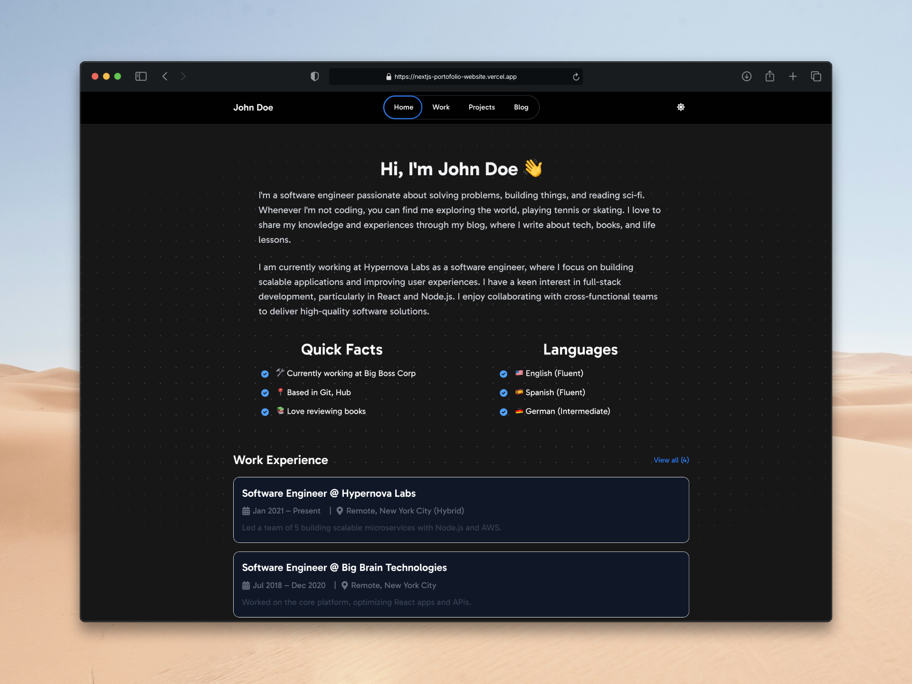
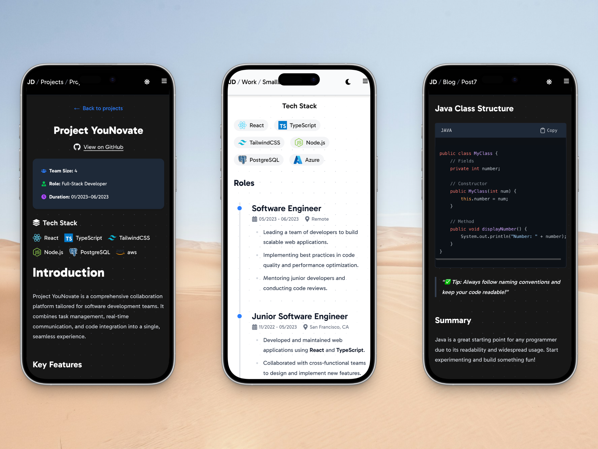

# Next.js Personal Website Theme

This is a custom personal website theme built using [Next.js](https://nextjs.org), bootstrapped with
[`create-next-app`](https://nextjs.org/docs/app/api-reference/cli/create-next-app). It’s designed as a minimal,
performance-focused starting point for showcasing your **work**, **writing**, and **projects**.

> **Note:** This theme is generally aimed at developers and designers who want to create a personal website
> quickly and easily. Yes, I'm aware there are many other templates and themes available—_you can literally find
> them all over the internet_. The personal goal of building this theme was to get familiar
> with [Next.js](https://nextjs.org), and improve skills in **React** and **TypeScript**.
> I also wanted to create a starter template for myself, since none of the existing templates met my exact design and
> functionality needs, without requiring extensive modifications. So...here we are! Feel free to use this as a starting
> point for your own personal website, or as a reference for doing the same thing I did: _building your own custom
> theme!_





---

## 🧱 Project Structure

The site is organized around the following main routes/pages:

- 🏠 **Home** – `/`
- 💼 **Work** – `/work`
- 🛠️ **Projects** – `/projects`
- ✍️ **Blog** – `/blog`

Each page is intentionally _simple_ and _clean_, making it easy to customize and build upon.

---

## 🚀 Getting Started

To start your development environment locally, after cloning the repository, run the following command
in the root directory of the project:

```bash
npm run dev
```

or via `pnpm` (recommended):

```bash
pnpm dev
```

Once the server is running, open [http://localhost:3000](http://localhost:3000) in your browser to view the
homepage. Running this command starts the app in development mode with hot-reloading enabled, so any changes you make to
the code will automatically reflect in the browser without needing to restart the server.

You can also build the project for production using:

```bash
npm run build
```

or via `pnpm`:

```bash
pnpm build
```

And then start the production server with:

```bash
npm start
```

or via `pnpm`:

```bash
pnpm start
```

---

## 💎 Key Features

- Main dashboard (Home page), with `/work`, `/projects`, and `/blog` links
- MDX support for blog posts, projects, and work items
- Syntax highlighting for code blocks in MDX files
- Light/dark mode toggle
- Responsive design for mobile and desktop
- SEO-friendly structure and metadata
- SSR support for pagination, sorting, and filtering of blog posts, projects, and work items
- Similar blog posts recommendations
- Blog post categories pages

## 🧭 Roadmap

Planned improvements and current/future features:

- [ ] 🖼 Add theme customization options:
  - [ ] Color palette
  - [ ] Layout options
  - [ ] Consistent color scheme across pages in tailwind.config.js
- [ ] 🧪 Add tests and linting support for better maintainability
- [ ] ❔ Add guides (i.e., READMEs) for creating blog/project/work pages

---

## 📚 Learn More

Want to dig deeper into `Next.js`, or other resources, and see how this theme works?

- [📘 Next.js Documentation](https://nextjs.org/docs): Core concepts and API
- [🎓 Learn Next.js](https://nextjs.org/learn): Interactive tutorial
- [🔗 GitHub – Next.js](https://github.com/nextjs): Source code and community discussion
- [📖 React Documentation](https://reactjs.org/docs/getting-started.html): Learn React
- [🎨 Tailwind CSS Documentation](https://tailwindcss.com/docs): Utility-first CSS framework
- [🌎 MDN Web Docs](https://developer.mozilla.org/en-US/): Comprehensive web development resources

---

## ▲ Deployment

The fastest way to deploy this app is
via [Vercel](https://vercel.com/new?utm_medium=default-template&filter=next.js&utm_source=create-next-app&utm_campaign=create-next-app-readme) —
the platform made by the creators of Next.js.

For more detailed instructions, check out
the [Next.js deployment guide](https://nextjs.org/docs/app/building-your-application/deploying).
If you do decide to use Vercel, this repository includes by default Analytics and Speed Insights integration.

> **Note:** This does not mean you _have_ to use Vercel. You can deploy this app on any platform that supports
> Node.js, such as [Netlify](https://www.netlify.com), [Render](https://render.com),
> [AWS Amplify](https://aws.amazon.com/amplify/), or much more.

---

## 🛠 Tech Stack

This project uses:

- ⚛️ [Next.js](https://nextjs.org) – React-based framework
- 💅 [Tailwind CSS](https://tailwindcss.com) - Utility-first CSS framework
- 🧱 [TypeScript](https://www.typescriptlang.org) – Static typing
- 📝 [MDX](https://mdxjs.com) – Markdown with JSX support

---

## 💎 Code Quality & Guidelines

This project follows best practices for code quality and style:

- Consistent code formatting using [Prettier](https://prettier.io)
- Linting with [ESLint](https://eslint.org) to ensure code quality
- Modular and reusable (React) components

> **Note**: For prettier, you can run `pnpm format:check` to check for formatting issues, and `pnpm format` to
> automatically format the code according to the defined style guidelines.

## 🪪 License

This project is licensed under the [MIT License](LICENSE).

## 💬 Feedback & Contributions

Got suggestions, issues, or ideas for improvement? Feel free to open an issue or submit a pull request.
Contributions are always welcome! Please see the [CONTRIBUTING.md](CONTRIBUTING.md) file for more details.
